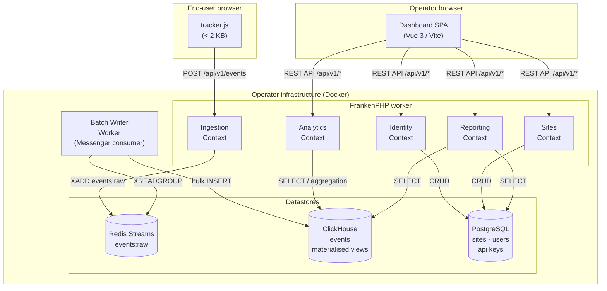
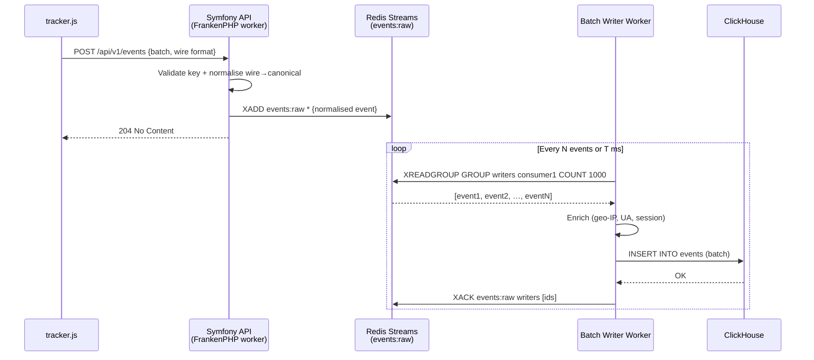

# Statflow — Architecture Overview

This document provides a high-level description of the Statflow system: its bounded contexts, data stores, ingestion pipeline, and the separation between the API and the SPA.  For the rationale behind individual decisions, refer to the [ADR index](./adr/README.md).

---

## Table of Contents

1. [System at a Glance](#system-at-a-glance)
2. [Bounded Contexts](#bounded-contexts)
3. [Datastores](#datastores)
4. [Ingestion Pipeline](#ingestion-pipeline)
5. [API / SPA Separation](#api--spa-separation)
6. [Component Diagram](#component-diagram)
7. [Sequence: Event Ingestion](#sequence-event-ingestion)

---

## System at a Glance

Statflow is a **privacy-first, cookieless, self-hosted** analytics platform composed of three deployable artefacts:

| Artefact | Technology | Role |
|----------|-----------|------|
| `packages/tracker` | Vanilla TypeScript < 2 KB | Thin browser script; collects and ships events |
| `apps/backend` | Symfony / PHP 8.3+ / FrankenPHP | REST API: ingestion, query, identity, reporting |
| `apps/frontend` | Vue 3 / TypeScript / Vite | Standalone SPA; consumes the REST API |

The backend is fronted by **FrankenPHP in worker mode**, which keeps a persistent PHP application in memory, eliminating per-request bootstrap overhead and enabling sustained high-throughput ingestion.

---

## Bounded Contexts

The backend is organised into six bounded contexts.  Each context owns its domain model, its commands/queries, and its infrastructure adapters.  Cross-context communication is mediated exclusively by the **event bus** (Symfony Messenger) or explicit application-service calls.

```
apps/backend/src/
├── Ingestion/     Context responsible for receiving, validating, and buffering raw events.
├── Analytics/     Aggregation queries, funnel computation, heatmap generation.
├── Identity/      Authentication, API key management, user accounts.
├── Sites/         Site registration, domain verification, tracker snippet generation.
├── Reporting/     Scheduled reports, data exports, alerting rules.
└── Shared/        Cross-context value objects, event contracts, domain primitives.
```

### Context interaction rules

- A context **must not** import domain entities from another context directly.
- Read-only data needed from another context is fetched via a **Query** on the `query.bus`.
- Side effects triggered by a context's actions are communicated via **Domain Events** published on the `event.bus` and consumed by listeners in the interested context.

---

## Datastores

| Store | Role | Access pattern |
|-------|------|----------------|
| **ClickHouse** | Analytical event store; all ingested events and materialised aggregates | Append-only writes (batch); heavy-aggregate reads |
| **PostgreSQL** | Application state: sites, users, API keys, subscriptions | OLTP — transactional reads and writes |
| **Redis Streams** | Ingestion buffer; decouples HTTP ingest rate from ClickHouse write throughput | Produce (ingestion API) / consume (batch writer worker) |

See [ADR-0005](./adr/0005-clickhouse-as-analytical-datastore.md) for the datastore selection rationale.

---

## Ingestion Pipeline

The write path is deliberately decoupled into three stages to ensure that brief ClickHouse write latency or backpressure never affects the tracker's HTTP response time.

```
Browser (tracker)
      │  POST /api/v1/events  (text/plain JSON body — compact wire format)
      ▼
FrankenPHP worker (Symfony)
  ├─ Validate tracker key + domain allowlist + rate limit
  ├─ Normalise wire → canonical event (docs/data-model/event-contract.md)
  ├─ Publish to Redis Stream  "events:raw"
  └─ Return HTTP 204 No Content immediately
      │
      ▼  (async — Symfony Messenger consumer, Redis transport)
Batch Writer Worker
  ├─ Reads N events from Redis Stream (configurable batch size, e.g. 1 000)
  ├─ Enriches: geo-IP lookup, device detection, session assignment
  └─ Bulk-inserts into ClickHouse via HTTP interface
      │
      ▼
ClickHouse
  ├─ events (MergeTree — immutable event log)
  └─ Materialised views → sessions, daily_stats, … (AggregatingMergeTree)
```

**Key properties of this design:**

- The tracker receives a `204 No Content` in < 5 ms; no database round-trip on the hot path.
  The write path is still asynchronous — the event is buffered in Redis Streams and written
  to ClickHouse by the batch writer — but the ingestion contract reports success as `204`
  (canonical decision; see `docs/api/README.md §6`).
- Redis Streams provide at-least-once delivery with consumer-group acknowledgement; events are never lost if the batch writer crashes mid-batch.
- ClickHouse `Buffer` engine or direct bulk inserts keep write amplification low.
- Enrichment (geo-IP, UA parsing) happens in the batch writer, not in the ingestion handler, keeping the ingestion API lean and latency-predictable.

---

## API / SPA Separation

The frontend (`apps/frontend`) is a fully **standalone SPA** that communicates with the backend exclusively through the **REST API**.  There is no server-side rendering, no Twig templates, and no shared session state.

```
apps/frontend  ──HTTP/JSON──►  apps/backend  (REST API, /api/v1/*)
     │
     └─ Served as static files (Vite build → Caddy, from the operator's own instance)
```

Authentication uses **short-lived JWT access tokens** (issued by `Identity` context) + refresh token rotation.  The SPA stores tokens in memory (not `localStorage`) to mitigate XSS token theft.

API design principles:

- Pure REST; no GraphQL or RPC.
- All responses are JSON; content-type negotiation is not supported.
- API versioning via URL prefix (`/api/v1/`).
- Error responses follow [RFC 9457 (Problem Details)](https://www.rfc-editor.org/rfc/rfc9457) — see `docs/api/error-catalog.md`.

---

## Component Diagram

## 100% Local Operation

Statflow is **fully self-contained**. A running instance makes **zero external
runtime calls** and sends **no telemetry**. Concretely:

- The tracker script is served from the operator's own instance (or their
  first-party proxy). There is no Statflow CDN.
- Geo-IP resolution uses an **embedded geo database** shipped with the backend
  image — no third-party geolocation API.
- Dashboard fonts and the world-map GeoJSON are **bundled** into the SPA build;
  nothing is fetched from Google Fonts or a tile server at runtime.
- The SPA is served as static files by the same Caddy instance that fronts the
  API. No external static host or CDN is required.

This is a hard constraint: any feature that would introduce an outbound runtime
dependency requires an explicit ADR.

---



---

## Sequence: Event Ingestion



---

## Further reading

- [ADR Index](./adr/README.md) — rationale for every significant architectural choice
- [Data model — ClickHouse](./data-model/clickhouse.md)
- [Data model — PostgreSQL](./data-model/postgres.md)
- [API reference](./api/README.md)
- [Tracker design](./tracker/tracker-design.md)
